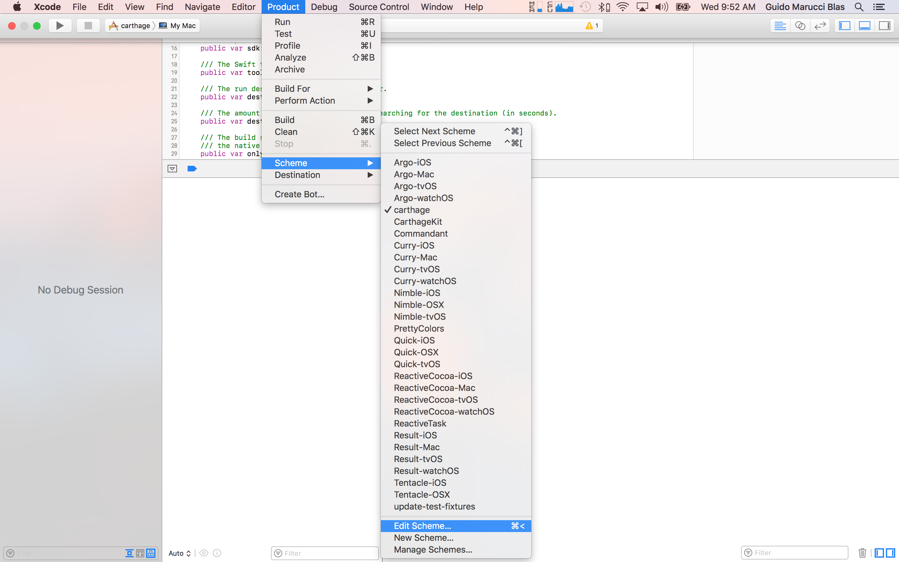
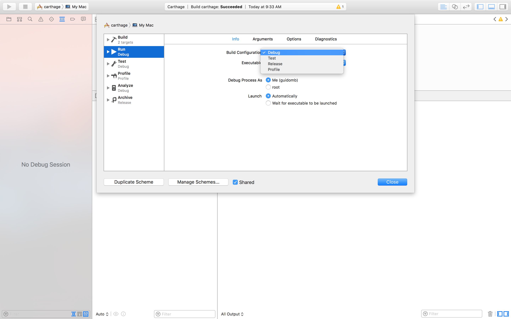

We love that you’re interested in contributing to Carthage!

## Carthage is simple

Please file issues or submit pull requests for anything you’d like to see! However, we make no promises that they’ll be accepted—many suggestions will be rejected to preserve simplicity.

## Prefer pull requests

If you know exactly how to implement the feature being suggested or fix the bug being reported, please open a pull request instead of an issue. Pull requests are easier than patches or inline code blocks for discussing and merging the changes.

If you can’t make the change yourself, please open an issue after making sure that one isn’t already logged.

## Target CarthageKit

Unless you’re specifically improving something about the command-line experience of Carthage, please make code changes to [CarthageKit](README.md#carthagekit). This framework increases modularity, and allows other tools to integrate with Carthage more easily.

## Get started

After checkout, you can run the following command from the cloned directory, and then open the workspace in Xcode:

```bash
make bootstrap
```

Then, to install your development copy of Carthage (and any local changes you've made) on your system, and test with your own repos:

```bash
make install
```

If you want to go back to the mainline Brew build, just uninstall the dev copy first:

```bash
sudo make uninstall
brew install carthage
```

## Run Carthage from Xcode

It may be useful to run Carthage on different `Cartfile`s or in "real" project for debugging purpose or to learn how Carthage works. Carthage is a regular macOS application so you can run it inside Xcode and set breakpoints! To do so you may want to change the arguments passed to Carthage's command line tool and probably also change the working directory.

 1. Select the `carthage` scheme in the Scheme chooser.
 

 2. The go to `Product > Scheme > Edit current scheme` or press ⌘ + <.
 

 3. On the edit scheme sheet, on the left column select `Run`.

 4. On the Info tab you may want to change the `Build Configuration` to `Debug`.
 

 5. You can set the arguments you want to pass to Carthage's command line tool in the `Arguments` tab.
 

 6. You can change the `Working Directory` on the `Options` tab. Choose a absolute path where a `Cartfile` is located.
 

 7. Run the application by going to `Product > Run` or ⌘ + R.

## Code style

If you’re interested in contributing code, please have a look at our [style guide](https://github.com/github/swift-style-guide), which we try to match fairly closely.

If you have a case that is not covered in the style guide, simply do your best to match the style of the surrounding code.

**Thanks for contributing! :boom::camel:**
